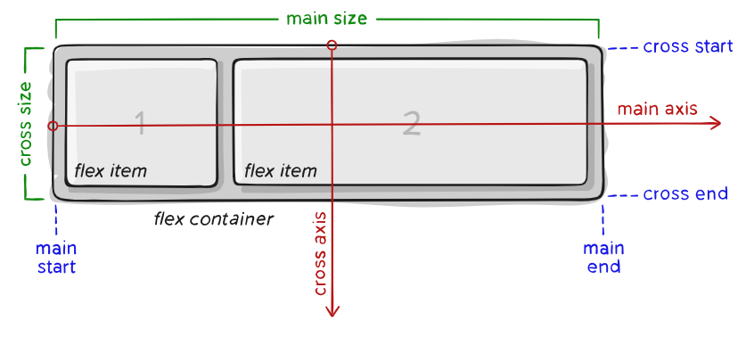

## CSS
- Helps your HTML be cute.
- 3 ways of adding CSS:
  1. Apply the attributes directly in the element tags
  2. Include all your CSS statements and rules in a `<style>` element at the top
  3. Include a `<link>` element with `rel=stylesheet` and `href` set to your stylesheet
- These will be applied in the order they are seen by the browser: the most recent will be applied on top of other styles
- Selectors (these select which elements get which styles):
  - Element name: like `body` or `header`, just picks all of that element
  - Descendant combinator: `section h2`, space delimited list where each item is a descendant of the one before (this example gets all the `h2` elements that are descendants, or within, `section` elements)
  - 

### Selectors & Attributes/Values Reference List
- `display: none` hides the element (good for media queries)
- `display: flex` makes the element a flex container, the children can have the `flex` attribute

### Animations
- I got nothing here so far.

### Flex

- This is the [website](https://css-tricks.com/snippets/css/a-guide-to-flexbox/) that I got my notes from
- IDK about prefixing stuff yet
- `flex-direction` is set to column if we want the children to be arranged top and bottom, and set to row if side by side is wanted



Parent/Container info:

- `display` refers to wether or not a container 
- `flex-direction` is the direction, horizontal or vertical, that the container flexes, and `row` is default
- `flex-flow` is shorthand for both the two upper options, the default of which is `row nowrap`
- `justify-content` defines alignment along the main axis, safest values are flex-start, flex-end, and center. `safe` ensures that
the spacing is such that the element won't render off-screen and can't be scrolled
- `align-items` is kind of like the justify-content version for the cross axis, `stretch` is the default and still respects min and max dimensions.
`safe` and `unsafe` keywords can also be used.
- `align-content` only works for multi-line flexible containers that have wrap enabled. Otherwise it's pretty much ignored
- `gap` determines the space between flex items (not for the outer edges) and is kind of like a minimum gutter

Example code:

```
.container {
   display: flex;
   flex-direction: row | row-reverse | column | column-reverse;
   flex-wrap: nowrap | wrap | wrap-reverse;
   flex-flow: row nowrap;
   justify-content: flex-start | flex-end | center | space-between | space-around | space-evenly | safe | unsafe;
   align-items: stretch | flex-start | flex-end | center | (first/last-)baseline;
   align-content: flex-start | flex-end | space-between | space-around | stretch | center;
   ...
   gap: 10px;
   gap: 10px 20px; /* row-gap column-gap */
   row-gap: 10px;
   column-gap: 20px;
}
```

Child/Item info:

- `order` is the order in which the item is placed, default is 0, and items with same order default to source order
- `flex-grow` allows the item to grow if necessary, accepts unitless value that acts as a proportion,  default is 0 (negaitve are invalid)
- `flex-shrink` is like flex-grow but for shrinking
- `flex-basis` defines the default size of a flex item, can be length (20%, 5em, etc.) or keyword, `auto` keyword means width or height property, `content` sizes based on the content it contains but isn't well supported yet
- `flex` is shorthand for `flex-grow`, `flex-shrink`, and `flex-basis`, and the default is `0 1 auto`, and is recommended above setting the properties individually
- `align-self` allows the `align-items` property to be overriden for individual flex items 

Example Code:

```
.item {
   order: 4;
   flex-grow: 2;
   flex-shrink: 3;
   flex-basis: auto;
   flex: 0 1 auto;
   align-self: auto | flex-start | flex-end | center | baseline | stretch;
}
```

### Media Queries

- Media queries detect certain conditions of the webpage, for example, if the page is in portait orientation
- The CSS inside the media query gets applied when the condition is true

Possible conditions:

- `orientation: portrait | landscape` detects the orientation of the viewport, applies if orientation is the one listed
- `max-height: "N"px` detects the height of the viewport, applies if the viewport is less than or equal to "N" pixels

Example code:

```
@media (condition: condition-param) {
   CSS goes here
}
```
```
@media (orientation: portait) {
   main {
      flex-direction: column;
   }
}

@media (max-height: 700px) {
   header {
      display: none;
   }
   footer {
      display: none;
   }
}
```

### Frameworks

- CSS Frameworks are essentially pre-written code that helps you speed up your styling
- Benefits: helps your website look good, speeds up the process of styling
- Drawbacks: your website will look like everyone else's

#### Bootstrap
- Bootstrap is the "reigning champ" of CSS frameworks, the downside is the page looking like everyone else's
- [Read this](https://getbootstrap.com/docs/5.2/getting-started/introduction/) later
- To put it in your application, just reference the Bootstrap CSS files from their CDN (Content Delivery Network):
```
<!DOCTYPE html>
<html lang="en">
  <head>
    <meta name="viewport" content="width=device-width, initial-scale=1" />
    <link href="https://cdn.jsdelivr.net/npm/bootstrap@5.3.3/dist/css/bootstrap.min.css" rel="stylesheet" integrity="sha384-rbsA2VBKQhggwzxH7pPCaAqO46MgnOM80zW1RWuH61DGLwZJEdK2Kadq2F9CUG65" crossorigin="anonymous" />
  </head>
  <body>
    ...
  </body>
</html>
```
- You can also add their JavaScript to your application at **the end** of the body section, just before the `</body>` tag:
```
<body>
  ...

  <script src="https://cdn.jsdelivr.net/npm/bootstrap@5.3.3/dist/js/bootstrap.bundle.min.js" integrity="sha384-kenU1KFdBIe4zVF0s0G1M5b4hcpxyD9F7jL+jjXkk+Q2h455rYXK/7HAuoJl+0I4" crossorigin="anonymous"></script>
</body>
```
- ***For future reference:*** you can install bootstrap with the NPM to run it off your machine:
```
npm install bootstrap@5.3.3
```
- Make sure the links above are to the most recent version of Bootstrap to use in your application
- HTML elements are styled with Bootstrap by using the proper class
- To change the default color of the document, place something like this into the custom CSS sheet:
```
:root {
  --bs-primary: #28a745; /* Change to green */
  --bs-primary-rgb: 40, 167, 69; /* RGB values for the same color */
}
```
#### Bootstrap Reference List
- Accordion Element:
  - Add a `<div>` with `class="accordion"`, this is the main container wrapper
  - Within that, add other `<div>` elements with `class="accordion-element"`, these are the individual section containers
  - Within that, add an `<h2>` element with `class="accordion-header"` with a `<button>``class="accordion-button"`

#### Tailwind