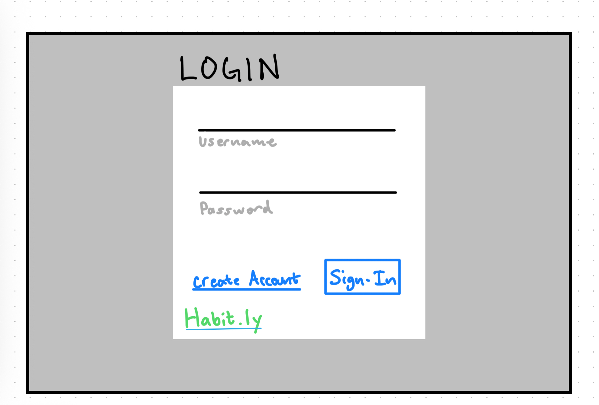
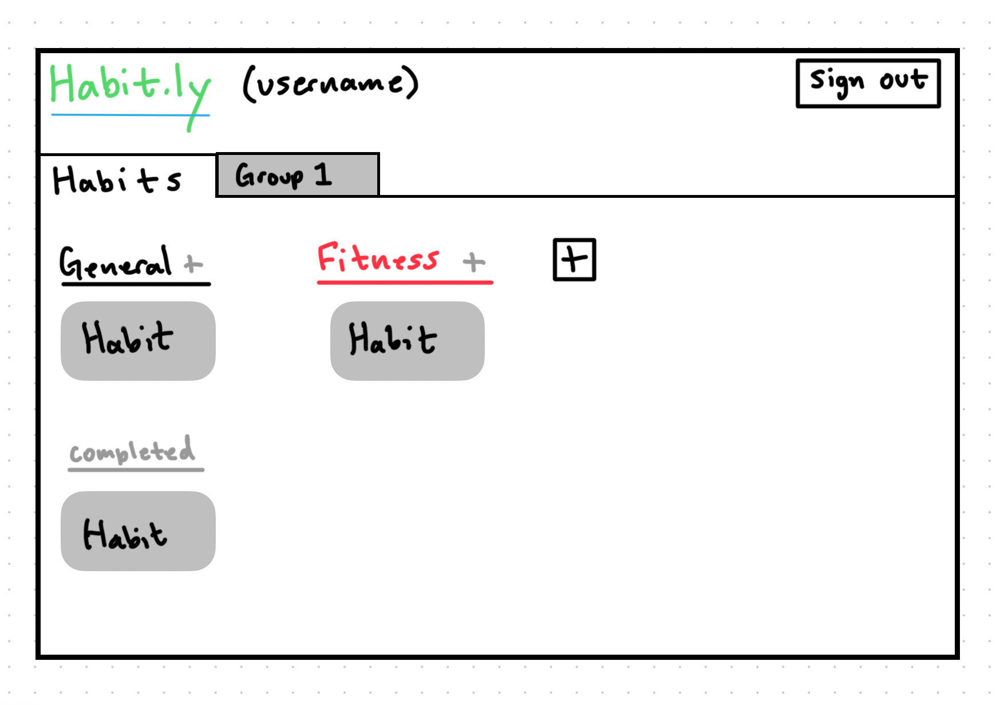
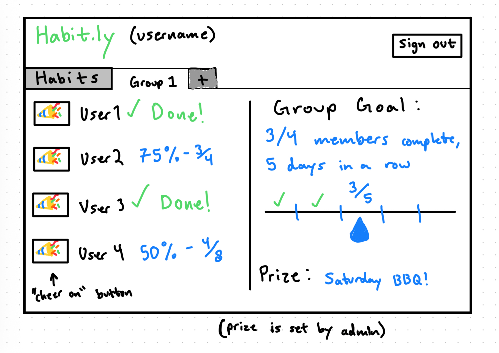

# James Day's Startup: Habit.ly

[My Notes](notes.md)

This application will allow users to track habits and motivate them to keep completing them. To do that, there will be accountability groups that users can form, "streaks" (consecutive days the habit has been completed) will be kept track of and displayed, and I possibly will add in gamifiaction to further the positive response users get from completing goals.

>  This is an example of a quote

>  Markdown [documentation](https://docs.github.com/en/get-started/writing-on-github/getting-started-with-writing-and-formatting-on-github/basic-writing-and-formatting-syntax) is here.

## 🚀 Specification Deliverable

> Fill in this sections as the submission artifact for this deliverable. You can refer to this [example](https://github.com/webprogramming260/startup-example/blob/main/README.md) for inspiration.

For this deliverable I did the following. I checked the box `[x]` and added a description for things I completed.

- [x] Proper use of Markdown
- [x] A concise and compelling elevator pitch
- [x] Description of key features
- [x] Description of how you will use each technology
- [x] One or more rough sketches of your application. Images must be embedded in this file using Markdown image references.

### Elevator pitch

This webapp allows users to enter custom habits that they can track. It'll keep track of consecutive days the habit has been completed, it will allow users to form accountability groups with other users to motivate them, and it will be FREE (Ad revenue could be introduced, but only banners that don't get in the way, no pop-ups)! It will be a webapp that supports people in achieveing their goals.

### Design

  

These drawings just show the login screen, the user's view of their habits, and the view of what an accountability group could look like.

### Key features

- Different habit types (binary, multi-part, numerical, etc.) to better track different behaviors
- Keeps track of streaks for habits
- Accountability groups to motivate you to complete your goals, and prizes set by the group owner for completing group goals
- Custom habit and goal categories (fitness, school, spiritual, etc.) to help users organize multiple habits

### Technologies

I am going to use the required technologies in the following ways.

- **HTML** - Use HTML to structure the pages within the webapp
- **CSS** - Styling the application and adding animations for a good feel for the user
- **React** - Frontend code to interact with a user, represent functionality with components, and route what is displayed using JavaScript and the React web framework. Basically, make it functional.
- **Service** - Login, logout, and register user support. Third party service will be to generate a random meme or somthing funny when a goal is met.
- **DB/Login** - Stores login for users, and what habits a user is keeping track of.
- **WebSocket** - Used to update the habits when a new day starts, and also to send messages to the accountability groups.

## 🚀 AWS deliverable

For this deliverable I did the stuff on Canvas.

- [x] **Server deployed and accessible with custom domain name** - [My server link](https://habitly.click).

## 🚀 HTML deliverable

For this deliverable I did the following. I checked the box `[x]` and added a description for things I completed.

- [x] **HTML pages** - I added HTML pages for index, about, habits, and groups.
- [x] **Proper HTML element usage** - I included the necessary elements and used a lot more, too.
- [x] **Links** - I added links to my GitHub repository, as well as the other HTML pages.
- [x] **Text** - I did in fact add text.
- [x] **3rd party API placeholder** - I added placeholders on the "about" page for an image and motivational quote.
- [x] **Images** - Only two images: the placeholder for 3rd party, and the icon (which will be changed later, it's a Poke Ball rn).
- [x] **Login placeholder** - I included login inputs that don't work.
- [x] **DB data placeholder** - The data that would be stored are the groups and habits. And login info I guess.
- [x] **WebSocket placeholder** - The WebSocket stuff would be the notifications on the "groups" page.

## 🚀 CSS deliverable

For this deliverable I did the following. I checked the box `[x]` and added a description for things I completed.

- [x] **Header, footer, and main content body** - I finally did this.
- [x] **Navigation elements** - I added those, too.
- [x] **Responsive to window resizing** - I did add flex. Let's see if it works lol.
- [x] **Application elements** - Yep.
- [x] **Application text content** - Also yep.
- [x] **Application images** - Just placeholders, but yes.

## 🚀 React part 1: Routing deliverable

For this deliverable I did the following. I checked the box `[x]` and added a description for things I completed.

- [x] **Bundled using Vite** - I did complete this part. I think.
- [x] **Components** - It's much simpler now (no "groups" feature).
- [x] **Router** - This is the one part I'm actually confident I did correctly.

## 🚀 React part 2: Reactivity deliverable

For this deliverable I did the following. I checked the box `[x]` and added a description for things I completed.

- [ ] **All functionality implemented or mocked out** - I did not complete this part of the deliverable.
- [ ] **Hooks** - I did not complete this part of the deliverable.

## 🚀 Service deliverable

For this deliverable I did the following. I checked the box `[x]` and added a description for things I completed.

- [ ] **Node.js/Express HTTP service** - I did not complete this part of the deliverable.
- [ ] **Static middleware for frontend** - I did not complete this part of the deliverable.
- [ ] **Calls to third party endpoints** - I did not complete this part of the deliverable.
- [ ] **Backend service endpoints** - I did not complete this part of the deliverable.
- [ ] **Frontend calls service endpoints** - I did not complete this part of the deliverable.
- [ ] **Supports registration, login, logout, and restricted endpoint** - I did not complete this part of the deliverable.

## 🚀 DB deliverable

For this deliverable I did the following. I checked the box `[x]` and added a description for things I completed.

- [ ] **Stores data in MongoDB** - I did not complete this part of the deliverable.
- [ ] **Stores credentials in MongoDB** - I did not complete this part of the deliverable.

## 🚀 WebSocket deliverable

For this deliverable I did the following. I checked the box `[x]` and added a description for things I completed.

- [ ] **Backend listens for WebSocket connection** - I did not complete this part of the deliverable.
- [ ] **Frontend makes WebSocket connection** - I did not complete this part of the deliverable.
- [ ] **Data sent over WebSocket connection** - I did not complete this part of the deliverable.
- [ ] **WebSocket data displayed** - I did not complete this part of the deliverable.
- [ ] **Application is fully functional** - I did not complete this part of the deliverable.
