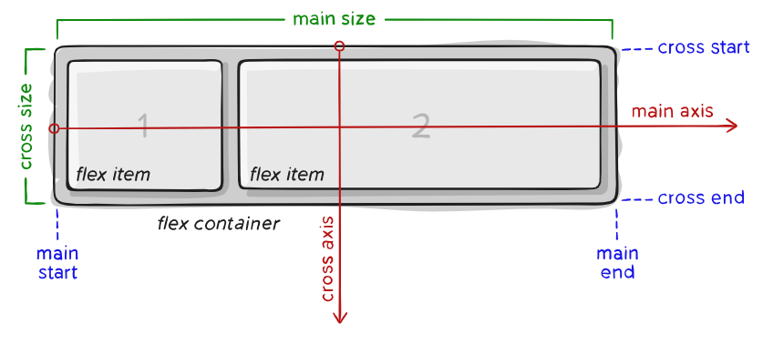

# James Day's CS 260 Notes

My startup: [Habit.ly](http://habitly.click)

## Helpful links

- [Course instruction](https://github.com/webprogramming260)
- [Canvas](https://byu.instructure.com)
- [MDN](https://developer.mozilla.org)

## GitHub
> [!IMPORTANT]
> Here's the Git workflow:
> - Pull (with `git pull`)
> - Change (make changes to code)
> - Commit (with `git commit -am "update(filename) update message"`)
> - Push (with `git push`)
>
> Pull, Change, Commit, Push!

- These are the [instructions](https://github.com/webprogramming260/.github/blob/main/profile/essentials/gitHub/gitHub.md) for getting GitHub set up from my CS 260 class, will be real helpful in the future for reference in case I gotta do anything over
- Save the file on your machine, then commit and push, otherwise nothing happens on GitHub

## AWS
- For setting up servers, use EC2 service from AWS
- For domain names, use Route53
- Make sure you have an AWS account first (with payments set up cuz this aint free)

### EC2 Basic Instructions
> [!NOTE]
> The AMI for the server is for this class, but I'm sure you could use it for personal stuff, too. Hopefully.

- From AWS console, go to the EC2 service
- Make sure the region is N. Virginia (for the AMI)
- Select `Launch Instance`
- Give the instance a name (a good convention is `[owner]-[purpose]-[version]`)
- Find the AMI with the ID `ami-018f3a022e128a6b2` and select it
- Select the server type, like t3.nano, that you want (be aware of prices)
- Create a new key pair or select an existing one (for ssh security)
- Enable `auto-assign public IP` and select an existing security group (or create one if you haven't already)
- Allow SSH, HTTP, and HTTPS traffic from anywhere
- If your server is a T3 class, then make sure `Credit specification` is set to `Unlimited` in the Advanced Details
- Click `Launch Instance`

#### How to SSH into the Server
- This uses the IP address from above to shell into the server
- Go to console window (Git Bash) and use the following command to shell into the server:
```
ssh -i [key pair file] ubuntu@[ip address]
```
- For example, mine would be (note that this is my elastic IP address, and a URL will work later once one is registered):
```
ssh -i [my key file] ubuntu@98.88.134.225
```
- If I get a warning about my key file permissions, then I can run the following command to help (IDK what it does lol):
```
chmod 600 mykeyfile.pem
```
- It's gonna say it hasn't seen the server before, but you're confident, so say yes
- You can now poke around
- Once finished, type `exit` to exit the ssh

#### Setting up Elastic IP Address
Stopping and starting your server will change the IP address when you start it up again,
so assigning an elastic IP address keeps that from happening. The first elastic IP address is free,
but only free while server is running, so for me I'll just keep it running. Good "just in case" thing.

- From AWS console, go to EC2 service.
- Make sure the region is set to the one where your server is.
- On left menu, navigate to `Network & Security` > `Elastic IPs`
- Click `Allocate Elastic IP address`
- Click `Allocate`
- Select the newly created address and click `Actions`
- Click `Associate Elastic IP address`
- Click on the `Instance` box and select the server instance
- Click `Associate`

### Route53 Basic Instructions

#### Leasing a Domain Name
> [!TIP]
> The TLD (Top Level Domains) are controlled by ICANN, and the `.link` and `.click` ones are usually the cheapest.

- From AWS Console, navigate to `Route53` > `Domains` > `Registered Domains`
- Click the `Register Domains` button
- Search for and select the domain you want and select it for purchase
- Fill out the contact details

> [!IMPORTANT]
> You may need to respond to an email to verify that your contact info is correct. Check the spam folder just in case, otherwise in 15 days the domain won't be yours anymore.

- Complete your order

#### Setting Up DNS Records
> [!NOTE]
> This connects your domain name to your server's public IP address (hopefully is an elastic one so you don't have to change it).

> [!IMPORTANT]
> The website will still use HTTP instead of HTTPS. That's what Caddy (below) is for.

- From AWS console, navigate to `Route53` > `Hosted Zones`
- You should see the domain name you just leased (if not, could be in `Domains` > `Pending Requests`).
- Select the domain name and click `View Details` to see the deets
- Create the root domain DNS record:
  1. Click `Create Record`
  2. Enter the public IP of the server in the Value box
  3. Click `Create Records`
  4. You should see a new `A` type record should appear (in addition to the `NS` and `SOA` types).
- Create a DNS record for any and all subdomains:
  1. Click `Create Record`
  2. Enter `*` in the `Record Name` box, this acts as a wildcard for any DNS that aren't explicitly defined
  3. Enter the public IP in the `Value` box
  4. Click `Create Records`
  5. One more `A` type record will appear, this one with an `*` in it

> [!TIP]
> Give it a few minutes for the domain name to kick in. I wasn't able to hit the domain name for a bit right after creating the records.

## Caddy
> [!NOTE]
> This is for setting up HTTPS and some security measures for the web app (See the [instructions](https://github.com/webprogramming260/.github/blob/main/profile/webServers/https/https.md) for more details).

### Caddy Basic Instructions
HTTPS and TLS are important parts of web security, and as part of the "handshake" that a client and server make to encrypt their data, they involve web certificates. Let'sEncrypt is a non-profit that gives out these certificates, and so we need to set up our server to get one using Caddy.

Caddy has ACME support (the way you get a certificate) built in, so all I need to do is configure Caddy with my URL. This is one of the few manual changes I will make.

- Open a console window (Git Bash for me)
- Use `ssh` to shell into the server (see above)
- Start editing the Caddy file with Vi:
```
cd ~
vi Caddyfile
```
- Replace both `:80` and both instances of `yourdomain` with your actual domain name. (this part was the trickiest, had to figure out Vi)
- Make sure it looks like the following code before finishing (uses myfunkychickens.click as the example):
```
myfunkychickens.click {
   root * /usr/share/caddy
   file_server
   header Cache-Control no-store
   header -etag
   header -server
}


startup.myfunkychickens.click {
   reverse_proxy * localhost:4000
   header Cache-Control no-store
   header -server
   header -etag
   header Access-Control-Allow-Origin *
}

simon.myfunkychickens.click {
   reverse_proxy * localhost:3000
   header Cache-Control no-store
   header -server
   header -etag
   header Access-Control-Allow-Origin *
}
```
- Might have to press `esc`, then save and exit Vi with `:wq`
- Restart the caddy stuff with the following command:
```
sudo service caddy restart
```
- This enables HTTPS on the web server. All done for now!

## HTML

### Intro Notes
- Stands for Hyper Text Markup Language
- Defines the content and structure of a web page (styling and interactivity are done with CSS and JavaScript, respectively).
- Elements are contained within tags, and the tags are contained in `<>` (the closing tag has a `/` before the name)
- Elements can have attributes, with values in single or double quotes (example: `attribute="value"`)
- The default HMTL file displayed when going to a website is `index.hmtl`, so that's a great place for the main/home page of the web application

> [!IMPORTANT]
> Use the Live Server extension in VS Code to display an HTML file on your machine locally to preview your work

### Structure, Media, and Input
- Structure is made up of the DOM/tree data structure. Has lots of tags, elements, and parent-child relationships between elements.
- Style can be added in the tags themselves, in a "style" tag in the head part, or by referencing a CSS stylesheet in the head

## CSS
- Helps your HTML be cute.

### Selectors & Attributes/Values Reference List
- `display: none` hides the element (good for media queries)

### Flex

- This is the [website](https://css-tricks.com/snippets/css/a-guide-to-flexbox/) that I got my notes from
- IDK about prefixing stuff yet
- `flex-direction` is set to column if we want the children to be arranged top and bottom, and set to row if side by side is wanted



Parent/Container info:

- `display` refers to wether or not a container 
- `flex-direction` is the direction, horizontal or vertical, that the container flexes, and `row` is default
- `flex-flow` is shorthand for both the two upper options, the default of which is `row nowrap`
- `justify-content` defines alignment along the main axis, safest values are flex-start, flex-end, and center. `safe` ensures that
the spacing is such that the element won't render off-screen and can't be scrolled
- `align-items` is kind of like the justify-content version for the cross axis, `stretch` is the default and still respects min and max dimensions.
`safe` and `unsafe` keywords can also be used.
- `align-content` only works for multi-line flexible containers that have wrap enabled. Otherwise it's pretty much ignored
- `gap` determines the space between flex items (not for the outer edges) and is kind of like a minimum gutter

Example code:

```
.container {
   display: flex;
   flex-direction: row | row-reverse | column | column-reverse;
   flex-wrap: nowrap | wrap | wrap-reverse;
   flex-flow: row nowrap;
   justify-content: flex-start | flex-end | center | space-between | space-around | space-evenly | safe | unsafe;
   align-items: stretch | flex-start | flex-end | center | (first/last-)baseline;
   align-content: flex-start | flex-end | space-between | space-around | stretch | center;
   ...
   gap: 10px;
   gap: 10px 20px; /* row-gap column-gap */
   row-gap: 10px;
   column-gap: 20px;
}
```

Child/Item info:

- `order` is the order in which the item is placed, default is 0, and items with same order default to source order
- `flex-grow` allows the item to grow if necessary, accepts unitless value that acts as a proportion,  default is 0 (negaitve are invalid)
- `flex-shrink` is like flex-grow but for shrinking
- `flex-basis` defines the default size of a flex item, can be length (20%, 5em, etc.) or keyword, `auto` keyword means width or height property, `content` sizes based on the content it contains but isn't well supported yet
- `flex` is shorthand for `flex-grow`, `flex-shrink`, and `flex-basis`, and the default is `0 1 auto`, and is recommended above setting the properties individually
- `align-self` allows the `align-items` property to be overriden for individual flex items 

Example Code:

```
.item {
   order: 4;
   flex-grow: 2;
   flex-shrink: 3;
   flex-basis: auto;
   flex: 0 1 auto;
   align-self: auto | flex-start | flex-end | center | baseline | stretch;
}
```

### Media Queries

- Media queries detect certain conditions of the webpage, for example, if the page is in portait orientation
- The CSS inside the media query gets applied when the condition is true

Possible conditions:

- `orientation: portrait | landscape` detects the orientation of the viewport, applies if orientation is the one listed
- `max-height: "N"px` detects the height of the viewport, applies if the viewport is less than or equal to "N" pixels

Example code:

```
@media (condition: condition-param) {
   CSS goes here
}
```
```
@media (orientation: portait) {
   main {
      flex-direction: column;
   }
}

@media (max-height: 700px) {
   header {
      display: none;
   }
   footer {
      display: none;
   }
}
```

### Frameworks

- CSS Frameworks are essentially pre-written code that helps you speed up your styling
- Benefits: helps your website look good, speeds up the process of styling
- Drawbacks: your website will look like everyone else's

#### Bootstrap


#### Tailwind

## React Part 1: Routing
- Placeholder

## React Part 2: Reactivity
- Placeholder
